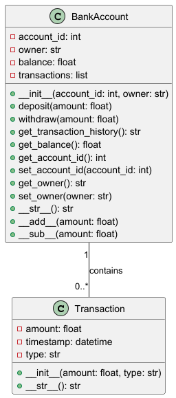

# Personal Account Management 
## Описание Программа предназначена для управления личным банковским счетом. Она позволяет открывать счета, пополнять баланс, снимать средства, отслеживать текущий остаток и вести учет всех транзакций. 

 